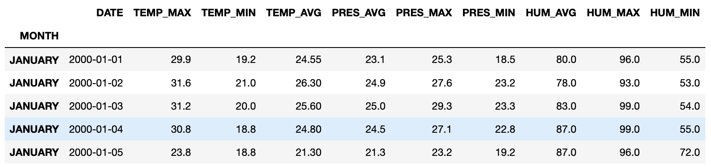

# WeatherForecasting

This task is to explain a regression model that predicts weather variables: air pressure, temperature and hummidity

## Weather Forecasting Model

The weather forecasting model is a neural network applied to temporal series. I takes as input several variables related to min, average and max values of temperature, humidity and pressure. This model uses **Long Short-Term Memory (LSTM)** networks, thar are a type of recurrent neural network capable of learning order dependence in sequence prediction problems. 

### Data

Dataset includes real daily measures of weather conditions from 2000 to 2018. A total of 6848 records. Each record contains the following variables:
* Min temperature, humidity and pressure
* Average temperature, humidity and pressure
* Max temperature, humidity and pressure

### The Black-box

The black box model is a **Long Short-Term Memory (LSTM)** network. Data is split into 14-days sequences, and the provided configuration estimates temperature from the other variables. However, this setup cam be modified by participants.

## Explaining Weather Forcasting

The challenge is to explain the prediction of the model, either by providing correlations to the input variables or by providing case-based explanations of previous episodes.

Teams must define a target (independent) variable from the provided dataset (by default: average temperature). Then, provide explanation methods given a concrete date and the estimated value of the target variable. These explanations can be graphical (charts, images, etc.) or textual.

Participants can either use existing explainer libraries or build their own explainers to generate explanations. 

### Submission

Participants can submit their code by creating a fork of this repository and. Once ready to submit, please submit a pull request.

Each submission should consist of an explanation process that recieves a date to be prediced/explanained, plus serveral examples showing the resulting explanation for different dates.

## Citation Request
Please site following paper for this task:

    @unknown{orozco2021,
      author = {Orozco-del-Castillo, Mauricio and Valdiviezo-N, Juan and H., Jorge and Navarro, Saul},
      year = {2021},
      month = {08},
      title = {Urban expansion and its impact on meteorological variables of the city of Merida, Mexico},
      doi = {10.13140/RG.2.2.17652.48003}
      }

